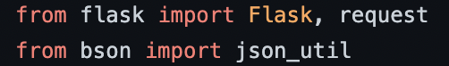
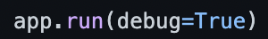
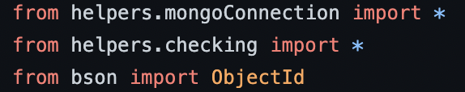
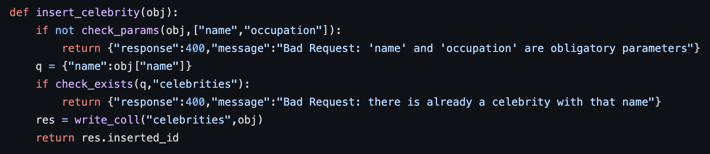
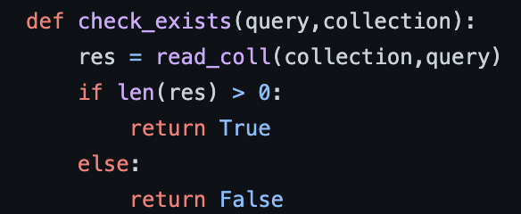
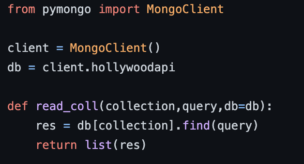

# Guide through this repo

This here repo contains code for an API.

## Application Program Interface
### Why are APIs so important?
#### We are not alone! 
API's are much more than a source of information.

Even though we have previously used API's to enrich data, it is definitely **not** the only use of this magic interfaces.

With programs getting more and more complex each day, a single application hardly ever cuts it. Also, with the modular nature of coding, where different blocks must work together for a final goal, we must have a way of communitcating between those and interacting them.

That's where API's _shine_. 🤩

#### We don't have to invent the wheel everytime
By the very natural modularity we've mentioned, it is very useful to have different programs working independently of the context in which they are.

This way, we can use the same processes in different applications without having to write it all again!

If we created an API to handle a database, this same API can be used to provide information for an App, web page, data visualization dashboard, machine learning modeling, and much more. And all of these would work independently with the same API providing data to each.

And even further, if we have to interact programs, imagine having to create the rules for communication **every single time** we must connect different software.

We would literally be living on the Babel tower, having to track which interface we have to use with which program. 😤

So, since we don't have to invent it every time, we use the HTTP protocol!

### HTTP protocol
The `Hypertext Transfer Protocol` is a 30 year old solid, concise, tested and proved protocol that we use everyday without knowing every time we do something online.

But we can use the same protocol (set of rules for communication) locally and between our programs.

The HTTP protocol is based on 7 [request methods](https://www.w3schools.com/tags/ref_httpmethods.asp): **GET, POST, PUT, HEAD, DELETE, PATCH, OPTIONS**

Each of them was conceived with a different purpose, but for our application and since we are not dealing with any sensitive data, we will begin just one and focus on just one, *GET*.

_`NOTE: If we were dealing with more complex applications, sending sensitive information and files, we should check out POST`_

### GET
This is the the most common type of request. It is a simple request and contains 2 parts:
>### URL
>The direction to which we request. (When we write our API in flask, each route will be asigned a specific python function, i.e.: a request to this route will execute this function)
>### Query string / Query parameters
>Those are pairs of key and value that we send with the request to make it more specific and so that the function is executed with some arguments.

### Flask
[Flask](https://flask.palletsprojects.com/en/1.1.x/) is one of the many python libraries that allows us to create API's easily.

It's job is to take all the work of dealing with request out of our hands. We will not have to worry about that. It will do it for us.

## The repo
Here is a diagram of the repository, the directories and files.

Check the `application` folder. Inside you will find a file called `api.py`.

## `api.py`
This is the main file on our API. This is where we will use flask, where we will define which route connects to which python function and where we will tell flask to run a server (i.e.: how we tell flask to begin listening for http requests for our routes). 

We begin by importing these two lines. Let's se what each of those does:

> ### `flask.Flask`
> This is the Flask class. We will use it to create an object that will be our API. It is what will connect each of the python functions we will write to a endpoint.
> ### `flask.request``
> This is the flask tool we will use to manage the query parameters. It will create a dictionary with key/values corresponding to the parameters
> ### `bson.json_util`
> This is a tool we will use to convert the documents from mongoDB into full fletch JSON objects. It will take care of the pesky ObjectId that is not automatically JSON compatible.

After the imports, we see the creation of the Flask object, assigned to the variable `app`. The single parameter is the name of the object, you can put a string there or simply use the python defined `__name__` variable to asign it the default name.

Then we can see the stars of out show, the endpoints. Those are the connections between the routes of our API and our python functions. It is done with a [decorator](https://realpython.com/primer-on-python-decorators/).

Let's look at one in detail:

The function we want to execute is `celebrities_new`. When we define it, we decorate it by puting `@app.route()` just on top of the function signature (the line with `def` on the function definition).
The argument passed to the decorator is a string with the endpoint (route) we want connected to this function. This way, every request to `/celebrities/new` will tell flask to execute this function.

Inside this function, we don't do much.
> We take the query params from `request.args` and assign it to a new variable `args` (request.args is an ImutableDictionary object, we just change it to the python default dictionary).
>
>Secondly, we call onto another function `insert_celebrity` and store the result.
>
> Finally, we return what we want the response of the request to be. The `json_util.dumps` is to properly convert the response, which contains ObjectId types to JSON.

`IMPORTANT`

The functions we use inside the endpoint functions have been imported on the begining of the file.

Lastly, we give flask a `go!` and tell it to begin listening to the requests. 😜

_`TIP: using the debug=True argument is a good help during the API development. It recognizes any change on the code and automatically restarts the API for us`_

That's all for this file.

## `helpers/celebrities.py`

On the helper file `celebrities.py`, we store the functions for our celebrity related endpoints.

After importing all we will need, we just write the code we want executed on a request for each endpoint, since these are the functions we called on the `api.py` file.

We could have these functions defined there, but since we want to modularize our code instead of keeping it all on the same box, we brought them here. It makes development, maintenance a lot easier and makes all the code a lot prettier to look at.

Let's check one of these functions in detail.

We can divide this function into 3 parts:

> ### 1. Checking if all required parameters were sent on the request
> It is done with a dedicated `check_params` function. In case this function returns a `False`, meaning the conditions were not met, an error message will be returned by the function and will be the response of the API.
>
> ### 2. Checking if a celebrity with the given name doesn't already exist on our database
> This is also done with a dedicated function `check_exists` that will browse the database for a celebrity with this name.
> This function will return a `True` in case the celebrity exists and in this case there will be a different error message.
>
> ### 3. Inserting the new element on the database
> In case neither of the previous checks fails, it means we have a green light to go ahead and add the document to the database, done with a helper function from our `mongoConnection.py` file. We make sure to get the result which will be the ObjectId of the new document and it is a good response for such an operation. 

All the other functions on this file follows the same kind of structure, with different checks depending on the operation we want to do. For example, for deleting celebrities, we must check it exists, on contrary to this first function.

Also, all the functions on the `movies.py` file follow the same logic and routine.

## `checking.py`
On an application such as this, where we must make sure some requirements are fullfiled for our code to execute properly (righ parameters, etc.) it is a very good idea to create a dedicated checking module, since we will be using it on a lot of different implementations.

For example, on the function below, we query the database to check whether a particular movie or celebrity exists, returning a True or False value accordingly:

## `mongoConnection.py`
We wouldn't be able to do anything with this api if we couldn't connect to the database.

Since we will be using mongo, we set up a mongoClient and a variable for our database.

Our functions on this file perform the basic [`CRUD`](https://en.wikipedia.org/wiki/Create,_read,_update_and_delete) operations to the collections on our database. 

Notably to mention the db parameter is set with a default value of our db database to make this function pure (non dependant of external values). This way we can use this function somewhere else with another database if ever needed.

Plus, we also make sure to create the database object here so we have a single mongo client running on the API. If we were to create multiple clients without closing them we could have performance problems with the api.

We chose to convert the cursos into lists before returning them. It is posible within this exercise since we are not dealing with massive quantities of data. If we had a huge database, it would be essential to implement some sort of [pagination](https://en.wikipedia.org/wiki/Pagination).

## Flow of imports
On the following diagram you can see the flow of the imports on this code and how the different files relate to each other.

